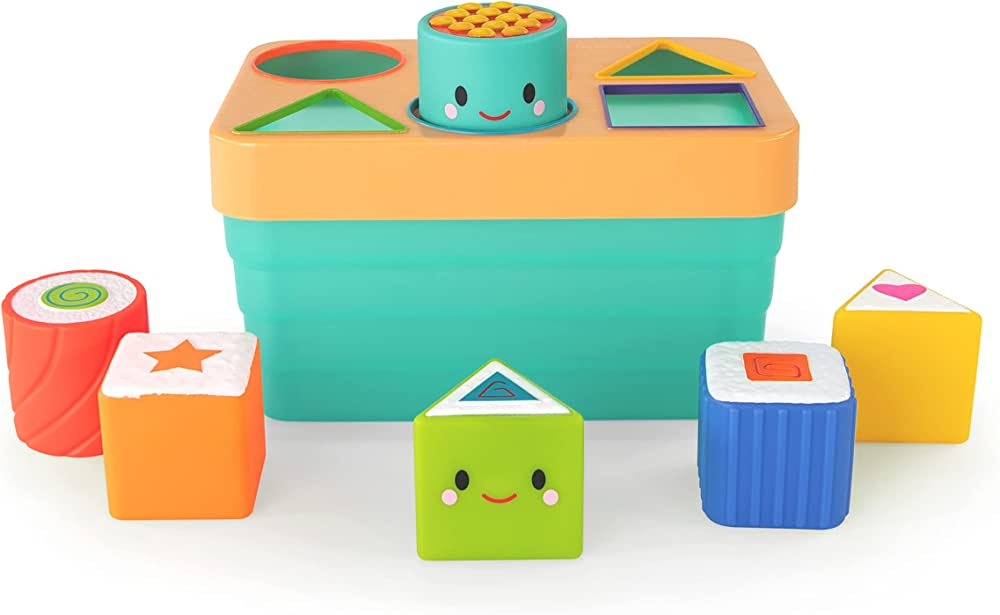
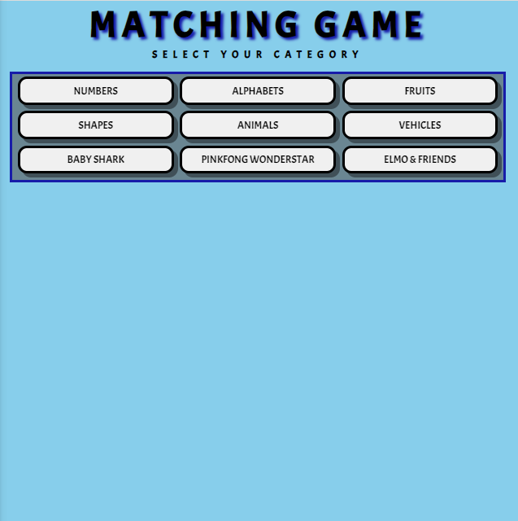
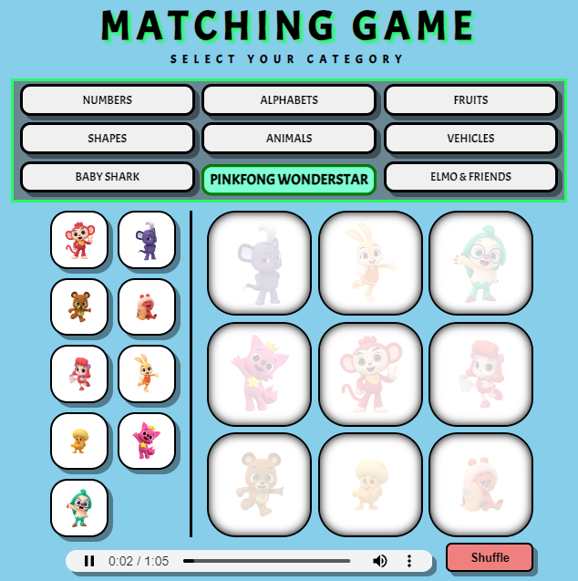
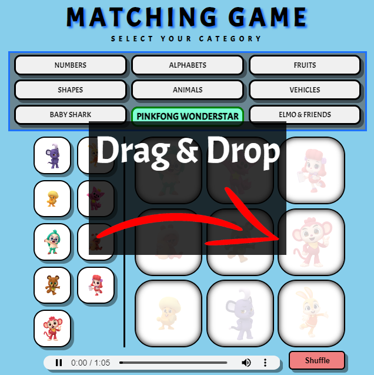
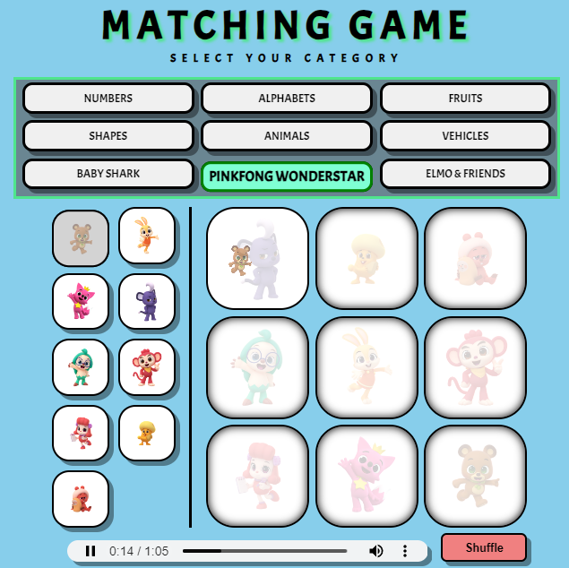
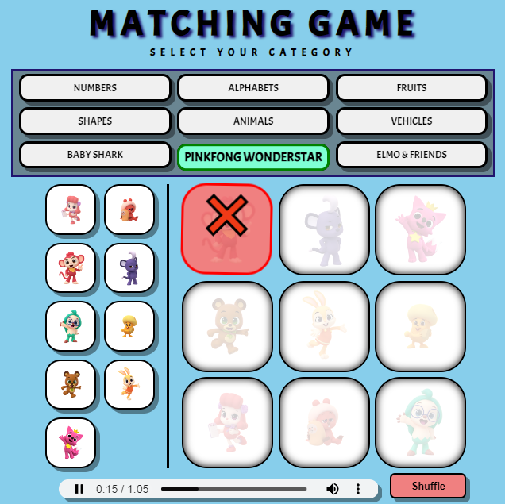
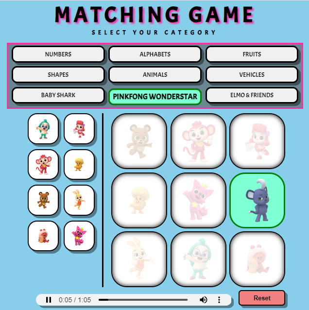
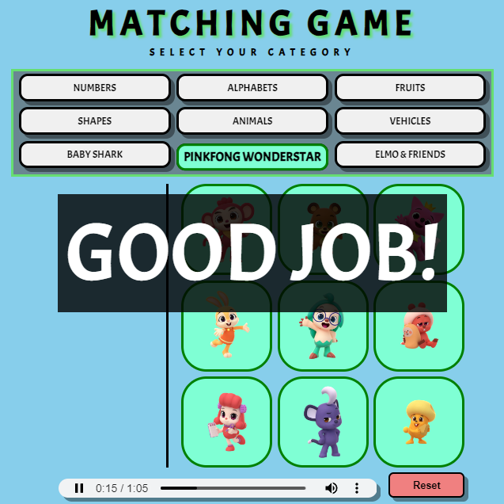

# Matching Game

**Game:**

 https://jabbacalvin.github.io/matching_game/

---

**Concept:**



---

***Game Demo***

Starting Page:



After Category Selection:



After Category Selection - On Screen Instruction:



Drag & Drop:



Drag & Drop (Incorrect):



Drag & Drop (Correct):



Winning Message:



---

**Wireframe:** 

https://excalidraw.com/#json=_bSDFRq0PhNl0HT-HdtJr,FNNAyeblu0ElXVMUpX1NDw

---

**Pseudocode:**
- Have arrays of categories
    - each category consists of an object of the name and the image
        - ```e.g.
            shapes = [
                {name: 'square', image: 'square.png'}
                {name: 'circle', image: 'circle.png'}
                               .
                               .
                               .   
            ];
            animals = [
                {name: 'dog', image: 'dog.png'}
                {name: 'cat', image: 'cat.png'}
                               .
                               .
                               .   
            ];
- Create a function that handles the categories
- Create a function that places the category items into the tiles
- Create a function that randomize the tiles for both the left and right side
- Create a function that handles the checks of the tiles being matched correctly or not
    - if yes, show green
    - if no, show red for a few seconds and bounce tile back to original position on the left
- Create a function that handles the drag and drop action
- Create a function that handles completion
- Create a function to handle reset

---

**Minimum Viable Product:**
- 2 categories working
- reset working
- start with click left side, click right side to match

---

**First Iteration:**

Turns out the logic for the click matching was harder than the drag and drop matching

**Second Iteration:**

Implemented drag and drop, the logic for showing the match is simpler

**Third Iteration:**

Added sounds and hidden categories

---

**Future Implementations:**
- Mobile friendly
- Clean up code
